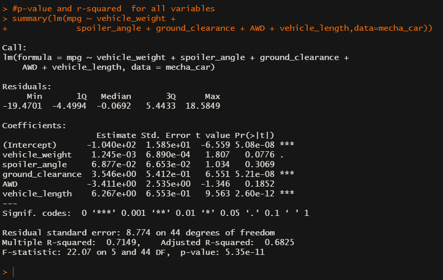
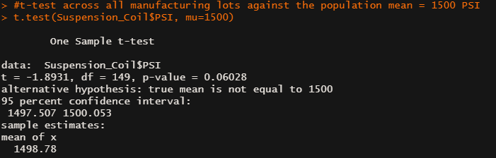
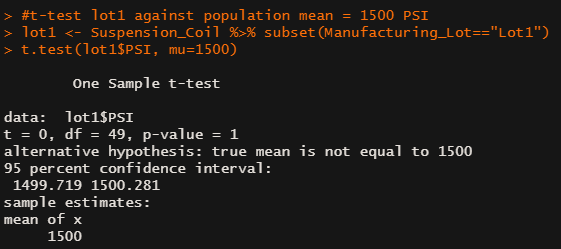
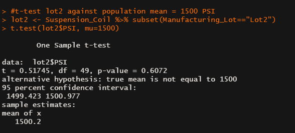
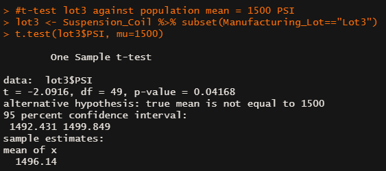

# MechaCar_Statistical_Analysis
MechaCar_Statistical_Analysis

## Project Overview
AutosRUs’ newest prototype, the MechaCar, is suffering from production troubles that are blocking the manufacturing team’s progress. AutosRUs’ upper management wants to have to review the production data for insights that may help the manufacturing team.

## Purpose

In this challenge, we need to perform following points on basis of statistics: 

- Perform multiple linear regression analysis to identify which variables in the dataset predict the mpg of MechaCar prototypes.
- Collect summary statistics on the pounds per square inch (PSI) of the suspension coils from the manufacturing lots.
- Run t-tests to determine if the manufacturing lots are statistically different from the mean population.
- Design a statistical study to compare vehicle performance of the MechaCar vehicles against vehicles from other manufacturers. 
- For each statistical analysis, you’ll write a - summary interpretation of the findings.

## Requirements

- Linear Regression to Predict MPG
- Summary Statistics on Suspension Coils
- T-Test on Suspension Coils
- Design a Study Comparing the MechaCar to the Competition

## Resources
Data Source: 
-	[MechaCar_mpg.csv](Data/MechaCar_mpg.csv)
-	[Suspension_Coil.csv](Data/Suspension_Coil.csv)

## Software: 
- RStudio
- Languages: **R**

## Results & Analysis

### Linear Regression to Predict MPG 

With multiple linear regression model, we are identifying which variables (vehicle weight, spoiler angle, ground clearance, AWD and vehicle length in our case) in the dataset predict the mpg of MechaCar prototypes. In simple words, we are asking if there is a relationship between variables and mpg of MechaCar prototypes. 

**Null hypothesis and Alternative hypothesis for linear regression**

For multiple linear regression model, following hypothesis will help to understand significant linear relationship between values:

**H0:** The slope of the linear model is zero, or m = 0 (If there is no significant linear relationship, each dependent value would be determined by random chance and error. Therefore, our linear model would be a flat line with a slope of 0).

**Ha:** The slope of the linear model is not zero, or m ≠ 0 (If there is significant linear relationship, each dependent value would not be determined by random chance and error. Therefore, our linear model would not be a flat line with a slope greater or lesser than 0).

<i>Figure 1: Linear Regression Results. </i>

#

**1. Which variables/coefficients provided a non-random amount of variance to the mpg values in the dataset?**

- To determine which variables, provide a non-random amount of variance to the mpg value we have to look at their individual **p-value**. 
- If the p-value is below 0.05 is statistically unlikely to provide random amounts of variance to the linear model, meaning that those variables have a significant impact on mpg. 
- According to our results *(Figure 1)* **ground clearance** (p-value = 5.21 x 10-8), **vehicle length** (p-value = 2.60 x 10-12), as well as **intercept** (p-value = 5.08 x 10-8) provided a non-random amount of variance to the mpg values in the dataset.
- When an intercept is statistically significant, it means there are other variables and factors that contribute to the variation in mpg that have not been included in the model. 
- These variables may or may not be within our dataset and may still need to be collected or observed (Source: Module 15.7.3).

**2. Is the slope of the linear model considered to be zero? Why or why not?**

- Based on our results (Figure 1) p-value is 5.35 x 10-11, which is much smaller than our assumed significance level of 0.05%. Therefore,
- We can state that there is sufficient evidence to reject our null hypothesis. 
- That indicates the slope of our linear model is not zero, meaning that there is significant linear relationship between variables and mpg of MechaCar prototype. (Source: Module 15.7.2).

**3. Does this linear model predict mpg of MechaCar prototypes effectively? Why or why not?**

- To determine if this linear model predict mpg of MechaCar prototypes effectively we need to look at its **r-squared** and **p-value**.
- According to our results *(Figure 1)* r-squared is 0.7149 and indicates a strong positive linear relationship, 
- Therefore, we can confirm that this linear model effectively predicts mpg of MechaCar prototypes (Source: Module 15.7.2).
#
### Summary Statistics on Suspension Coils

**The design specifications for the MechaCar suspension coils dictate that the variance of the suspension coils must not exceed 100 pounds per square inch. Does the current manufacturing data meet this design specification for all manufacturing lots in total and each lot individually? Why or why not?**

**Lot Summary(total_summary)**

The current manufacturing data meet this design specification for all manufacturing lots in total. According to the results (Figure 2) shows that variance is 62.29 PSI, that is within requirements of not exceeding variance 100 PSI.

<i>Figure 2: Summary Statistics on Suspension Coils for All Lots. </i>

**Indivisual lot Summary(lot_summary)**

The current manufacturing data partially meet this design specification for each lot separately. According to the results (Figure 3), it shows that Lot 1 and Lot 2 meet the design specification with a variance is 0.9795918 and 7.4693878 PSI respectively, and it is within requirements of not exceeding variance 100 PSI. Lot 3 does not meet the design specification, because of its variance of 170.286122 PSI and that exceed the requirements variance of 100 PSI.

<i>Figure 3: Summary Statistics on Suspension Coils for Individual Lots. </i>

#

### T-Tests on Suspension Coils

We are performing **one-sample t-test**, that is used to determine whether there is a statistical difference between the means of a sample dataset (suspension coil data set) and a population dataset with a given mean of 1,500 PSI. With the t-test, we are establishing the following hypothesis:

**H0:** There is no statistical difference between the suspension coil data set mean and its presumed population mean of 1,500 PSI.

**Ha:** There is statistical difference between the suspension coil data set mean and its presumed population mean of 1,500 PSI.

In order to **reject** or **fail to reject our null hypothesis** we have to look at the **p-value** that determines if there is a statistical difference between the observed sample mean and its presumed population mean.
According to the result *(Figure 3)* p-value for all manufacturing lots is 0.06028, for lot 1 = 1, for lot 2 = 0.6072, and for lot 3 = 0.04168. In both lot 1 and lot 2 cases p-value is above the assumed significance level of 0.05. Therefore, there is not enough evidence, and **we fail to reject the null hypothesis**, meaning that the two means not statistically different.

 

<i>Figure 4: t-Test for All Lots Total. </i>

 

<i>Figure 5: t-Test for Each Lot Individually. </i>

## Study Design: MechaCar vs Competition

**What metrics would be of interest to a consumer (cost, city or highway fuel efficiency, horse power, maintenance cost, or safety rating .etc.)?**

As per the environmental awareness customers are more cautious about pollution and car emissions as well as fuel efficiencies around city and highways.
In this case electric cars, hybrid cars are popular in consumers, But because of cost people can’t afford or don’t want to invest in it.
Mechacar can provide good alternate. So, we would test following metrices to compare Mechacar against competition.

**Competition: City and Highway fuel efficiencies.**

**What is the null hypothesis or alternative hypothesis?**

- Null Hypothesis: The cars in the same class have the same fuel efficiencies.

- Alternative Hypothesis: The Alternative Hypothesis is that they are not all the same.

**What statistical test would you use to test the hypothesis? And why?**

- To test the hypotheses, ANOVA test comes in the picture. It also known as Analysis of Variance.
- ANOVA is used to test the means of a single dependent variable across a single independent variable with multiple groups.
- Here we would use an ANOVA test to complete this analysis for both types of fuel efficiencies.
- Also, we can use the ggplot2 library to show the potential spread between different cars using a boxplot.

#### What data is needed to run the statistical test?

To run this statistical test, we need the data from:
- vehicle ID, fuel efficiency data, class type data
- It will need fuel efficiency data from 50 individual cars.
- Then we can create a sample size of data for each car in the class type.
- For example, if there were 10 cars in the class type, then we can have a top of 500 data points collected for each fuel efficiency type.
